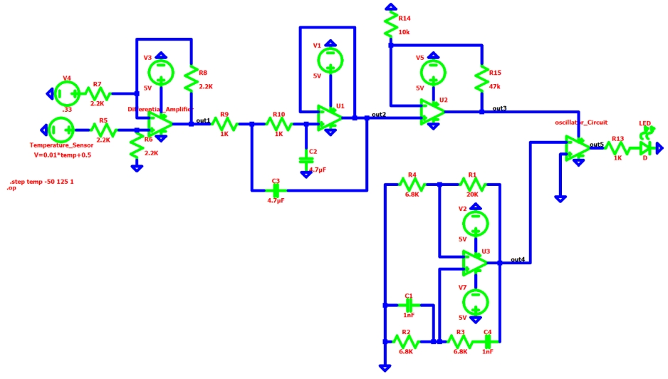
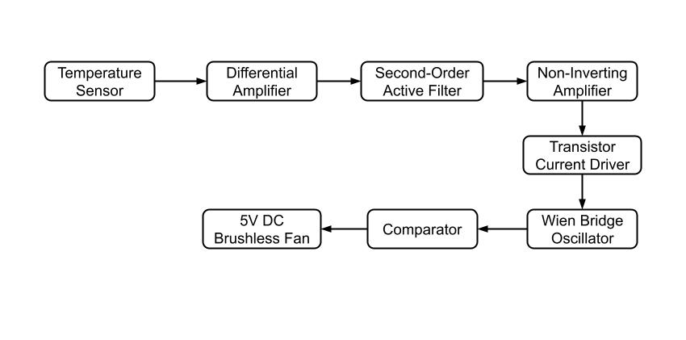

# analog-temp-controlled-fan
Analog temperature-controlled fan system designed with a TMP36 temperature sensor, differential and non-inverting amplifiers, second-order active filtering, a Wien bridge oscillator, and transistor-based fan control.

<p align="center">
  
</p>

## Table of Contents
[The Problem](#the-problem)  
[What I Built](#what-i-built)  
[System Design](#system-design)  
[Circuit Design](#circuit-design)  
[Components & Tools](#components-and-tools)  
[Simulation & Validation](#simulation-and-validation)  
[Design Evolution](#design-evolution)  
[Demo](#demo)  
[Results](#results)  
[Challenges & What I Learned](#challenges-and-what-i-learned)  
[Repository Contents](#repository-contents)  
[References](#references)  
[About Me](#about-me)

## The Problem
Electronic systems can require active cooling as operating temperatures increase. A continuously running fan provides cooling regardless of the current temperature, while manual control requires someone to monitor the temperature and adjust the cooling system. 

The goal of this project was to develop a system that could automatically respond to changes in temperature and activate a cooling fan when additional cooling was needed. Rather than relying on a microcontroller, the system was designed using analog signal processing and discrete components to sense, condition, filter, and amplify the temperature signal before using it to control a 5 V cooling fan.

## What I Built
I designed and implemented an analog temperature-controlled fan system that uses a TMP36 temperature sensor to measure temperature and a series of analog circuit stages to process the sensor output and control a 5 V brushless DC fan.

The final system uses a differential amplifier, second-order active low-pass filter, non-inverting amplifier, Wien bridge oscillator, comparator, and transistor driver to condition the temperature signal and provide the current and switching signal required by the fan.

The project was developed iteratively through three milestones, beginning with a simple temperature-triggered LED and progressing to the final fan-control system.

<p align="center">
  
</p>

## System Design
The signal flows through six stages, each conditioning the output of the last so it falls within the input range the next stage expects:

Sensing -> Comparing -> Filtering -> Amplifying -> Pulse-driving -> Output

The TMP36 produces a voltage that scales linearly with temperature. An OP484 differential amplifier subtracts a fixed reference voltage from that signal, so the output tracks how far above a baseline the temperature is, rather than switching between two fixed states like a simple comparator would. That signal is cleaned up by a second-order active low-pass filter, then boosted by a non-inverting amplifier to a range the fan stage can use. Because the fan is a DC motor with physical inertia and coil inductance, it can't be driven by a steady low-current analog signal without stalling. As a result, a Wien bridge oscillator and comparator convert the amplified signal into a high-frequency switching (pulsed) drive signal, and a transistor supplies the current the fan actually needs. The full derivation, values, and reasoning for each stage are below in [Circuit Design](#circuit-design).

## Circuit Design

The final (Milestone 3) circuit is built from the following stages. Values shown are the ones used in the final design unless noted otherwise.

### Temperature Sensor (TMP36)

**Role:** Converts ambient temperature into a proportional voltage.

**Equation:** Vout = 0.01·T + 0.5 V, where T is temperature in °C (10 mV/°C scale factor, 0.5V offset)

**Values:** Supplied at 5V (Vs+), GND on leg 3, Vout on leg 2

**Why this component:** The TMP36 was chosen because its output scales linearly with temperature, which makes it straightforward to interface with downstream op-amp stages. Its −40°C to +125°C range comfortably covers room-temperature and elevated operating conditions, its built-in 0.5V offset keeps the output positive even at negative temperatures, and its accuracy (~±1°C) and 10 mV/°C scale factor made it reliable without needing extra calibration circuitry.

### Differential Amplifier (OP484)

**Role:** Outputs the difference between the sensor voltage and a fixed reference, so the response scales continuously with temperature instead of snapping between two states like the comparator used in Milestone 1.

**Equation:** Vout = (R8/R7)(Vin+ − Vin−), with R7 = R8 so gain = 1

**Values:** Four 2.2kΩ resistors (equal, for unity gain); reference (Vin−) = 0.33V; V+ supply = 5V; V− = GND

**Why this component:**
The OP484 was used here (replacing the OP97 comparator from Milestone 1) specifically because it's rail-to-rail. The differential amplifier's output needs to represent low voltages accurately near 0V and scale cleanly up to 5V. A non-rail-to-rail op-amp like the OP97 can't reach or resolve those extremes correctly. Gain was deliberately kept at 1 at this stage; amplifying here would also amplify the noise the op-amp itself introduces, which is why amplification was pushed to a later, dedicated stage.

### Second-Order Active Low-Pass Filter (OP484)

**Role:** Removes high-frequency noise introduced by the differential amplifier before the signal is amplified further.

**Equation:** Fc = 1/(2π√(R1·R2·C1·C2)), with R1 = R2 and C1 = C2

**Values:** R1 = R2 = 1kΩ, C1 = C2 = 4.7µF → Fc ≈ 33.9–34 Hz (calculated 33.9 Hz, simulated 33.95 Hz, measured 34 Hz)

**Why this component:** This replaced the first-order passive RC filter used in Milestone 2. The passive filter worked fine in isolation, but the stage after it would draw a small amount of current from it, shifting the effective cutoff frequency. An active filter isolates the RC network from that loading effect. Resistors and capacitors were kept equal specifically to hold the filter's gain at exactly 1. Gain above 1 makes a second-order active filter unstable, and above 3 it turns into an oscillator outright, so unity gain was a hard constraint here. The OP484 was used again for its rail-to-rail range, since the signal at this point is still well under 1V.

### Non-Inverting Amplifier (OP484)

**Role:** Scales the filtered signal up to the 3–5V range the fan stage needs.

**Equation:** Vout = (1 + R4/R3)·Vin+

**Values:** R3 = 10kΩ, R4 = 47kΩ → gain = 1 + 47/10 = 5.7x

**Why this component:** An earlier version of this stage (Milestone 2) used the OP97 with a gain of 11x (R3 = 1kΩ, R4 = 10kΩ), which worked when the signal levels were in the 0–0.5V range feeding a 0–5V LED-driving output. In Milestone 3, the pre-amplified signal is under 1V and the OP97's non-rail-to-rail limitation produced incorrect output at these lower voltages, so the amplifier was rebuilt using the OP484.

### Wien Bridge Oscillator (OP97)

**Role:** Generates a continuous high-frequency sine wave used to build a pulsed drive signal for the fan, since a DC motor's coil inductance and physical inertia cause it to stall under a low, steady drive voltage.

**Equations:** f = 1/(2π·R·C); Gain = 1 + R1/R4 (must exceed 3 for sustained oscillation)

**Values:** R2 = R3 = 6.8kΩ, C1 = C4 = 1nF → f ≈ 23.4 kHz (calculated and simulated); R4 = 6.8kΩ, R1 = 20kΩ → gain ≈ 3.95

**Why these values:** The oscillation frequency needed to land in the 20–25 kHz range so the fan's motor could "average out" the pulses into what feels like smooth, continuous drive. The gain resistors were chosen to sit just above the theoretical minimum of 3 required to sustain oscillation since below 3 the oscillation converges to 0, and choosing a value just above 3 lets the amplitude grow until it's capped by the supply rails rather than growing unbounded. Experimentally, the physical circuit only reached ~11.6 kHz instead of the designed 23.4 kHz, which was traced to the OP97's slow slew rate (0.2 V/µs) (it can't switch fast enough at that amplitude). This didn't end up mattering for the design, since the oscillator only needs to produce a clean, symmetric sine wave centered at 0V for the comparator stage to work.

### Comparator

**Role:** Converts the oscillator's sine wave into a square wave that switches the fan drive on and off at high frequency.

**How it works:** The oscillator's sine wave (centered at 0V) is fed into the comparator's inverting input, with the non-inverting input tied to ground. This makes the output switch between the amplifier's output voltage (V+) and 0V (V−, ground), producing a square wave whose "high" level equals the current temperature-scaled drive voltage.

### Transistor (TIP31C NPN) 

**Role:** Boosts current from what the op-amp stages can supply up to what the fan actually requires.

**Equation:** Iout = hFE · Ib, with hFE ≈ 25–50 and Ib ≈ 20–40 mA

**Why this component:** Before the transistor stage, the circuit could only supply 20–40 mA (enough for an LED, such as in Milestones 1 and 2, but far short of the ~200 mA the 5V DC fan needs to run). The TIP31C was chosen to bridge that gap, amplifying the available current past the fan's operating threshold without needing a redesign of the earlier signal-conditioning stages.

### Output (5V DC Brushless Fan)

**Role:** Provides physical cooling, turning on past the trigger point and scaling its effective drive with temperature above that.

**Specs:** Operates in the 3–5V range, draws ~200 mA, ~30mm × 30mm

**Why this component:** The fan needed to match the circuit's available voltage range (3–5V) without exceeding what the power supply could provide. A brushless design was chosen specifically because it has a longer operational life (no brushes to wear out) and produces less electrical noise than a brushed motor — which matters here since the TMP36's analog output is small and noise-sensitive. It's also simple to wire into a breadboard prototype, needing only power and ground.

The full LTspice schematic is linked in the Project Manual and included in this repository (see [Repository Contents](#repository-contents)).

## Components and Tools
### Core ICs

- TMP36 temperature sensor: linear analog output, −40°C to +125°C range, 10 mV/°C with 0.5V offset
- OP97: comparator (used in MS1 and MS2); non-rail-to-rail, single-supply operation
- OP484: differential amplifier, active filter, and non-inverting amplifier stages (MS2/MS3); rail-to-rail input/output, needed for low-voltage accuracy
- TIP31C: NPN epitaxial silicon transistor, current driver for the fan stage

### Passive Components

- Resistors: 1kΩ, 1.5kΩ, 2.2kΩ, 6.8kΩ, 10kΩ, 20kΩ, 47kΩ (values selected per stage, see Project Manual for derivations)
- Capacitors: 1µF (MS2 passive filter), 4.7µF (MS3 active filter), 1nF (Wien bridge oscillator)

### Output

- 5V DC brushless fan (~30mm × 30mm, ~200 mA draw)
- Red LED (used as a stand-in output in MS1/MS2, and in LTspice simulations in place of the fan since no 5V fan model exists in the LTspice library)

### Tools & Software

- LTspice: schematic capture, DC sweep, AC sweep/Bode plot, and transient simulation
- Analog Discovery (with Waveforms/Network Analyzer): bench measurement, Bode plots, oscilloscope captures
- Handheld multimeter (Extech): voltage/current verification on the breadboard
- Breadboard prototyping

## Simulation and Validation
Every building block was simulated in LTspice before being validated experimentally, generally following the same three-step process: 

analytical calculation -> LTspice simulation -> breadboard measurement.

**MS1 (Comparator/LED trigger):** DC sweep (.step temp -50 125 1) confirmed the comparator output jumped from 0V to 3V at the 24°C threshold (0.74V sensor output), matching the design equation exactly in simulation. On the bench, the OP97's non-rail-to-rail behavior meant the measured output was 2.26V instead of the ideal 3V, accounting for this brought calculated and measured current to a 0% error.

**MS2 (Differential amp + passive filter + non-inverting amp):** AC/DC sweeps confirmed the differential amplifier scaled from 0V to 5V, the passive filter's cutoff landed at 15.9 Hz (calculated) vs. 14.3 Hz (measured, ~10.1% error), and the non-inverting amplifier's 11x gain matched analytical predictions within ~5.2% error.

**MS3 (Active filter + oscillator + fan stage):** The second-order active filter's cutoff was calculated at 33.9 Hz, simulated at 33.95 Hz (0.15% error), and measured at 34 Hz (0.30% error). The Wien bridge oscillator was calculated to run at 23.4 kHz; simulation matched almost exactly (23 kHz, ~0.02% error), but the physical circuit measured only 11.6 kHz, roughly 50% off. This was traced to the OP97's slow slew rate (0.2 V/µs), which can't keep up with a 23.4 kHz square-wave-like swing at that amplitude, this was ultimately not a problem for the design, since the frequency and amplitude out of the oscillator only need to be "good enough" going into the comparator.

Additional analysis exercises (Ohm's Law, comparator behavior, Thevenin/s-domain equivalents, phasor analysis, and complex power) were performed on individual building blocks to validate design choices (these are included in the Proof of Concept documents for each milestone).
## Design Evolution

### Milestone 1 (Comparator + LED)

A TMP36 feeds an OP97 comparator that switches an LED fully on/off at a fixed temperature threshold (24°C / 0.74V). One limitation of this design is the lack of proportional response to temperature.

**Problem:** LED wouldn't light up. 

**Cause:** broken ground channel on the breadboard. 

**Fix:** bridged the gap with a jumper wire.

### Milestone 2 (Differential amplifier + passive filter + non-inverting amp)

Replaced the comparator with an OP484 differential amplifier so the output would scale continuously with temperature instead of snapping between two states. Added a first-order passive RC low-pass filter (15.9 Hz cutoff) to remove noise, and a non-inverting amplifier (gain of 11) to scale the signal toward a usable range.

**Problem:** The original comparator-based design caused an abrupt 0V->5V jump. 

**Fix:** switched to a differential amplifier for a continuous response.

**Problem:** The OP97 wasn't rail-to-rail, so it couldn't accurately represent the scaling low-voltage signal. 

**Fix:** switched to the rail-to-rail OP484.

**Problem:** Amplifying before filtering amplified the op-amp's own noise along with the signal. 

**Fix:** kept the differential amplifier at unity gain and placed the passive filter before the amplification stage.

### Milestone 3 (Active filter + Wien bridge oscillator + transistor + fan)

Replaced the LED with an actual 5V DC brushless fan, which required a real current driver and a way to keep the motor from stalling. Upgraded the first-order passive filter to a second-order active filter (to avoid the passive filter's cutoff frequency shifting under load), added a Wien bridge oscillator + comparator to generate a high-frequency pulse-drive signal, and added a TIP31C transistor to supply the ~200 mA the fan needs (versus the 20–40 mA the op-amps alone could provide).

**Problem:** Second-order active filter became unstable when given gain > 1 (and turned into an oscillator above gain 3). 

**Fix:** kept the filter's gain at 1 and moved amplification to a separate non-inverting amplifier stage (gain ≈ 5.7x).

**Problem:** Replicating the MS2 non-inverting amplifier with the OP97 didn't work at the new signal levels (<1V). 

**Fix:** implemented the non-inverting amplifier using the rail-to-rail OP484 instead.

## Demo

## Results
The completed system reliably scales its response with temperature across all three stages of testing:

- The differential amplifier + active filter chain produces a clean, temperature-proportional voltage with the noise from the OP484 stages suppressed by ~−40 dB/decade above the 34 Hz cutoff.
- The non-inverting amplifier scales that signal into the 0–5V range the fan stage needs.
- The Wien bridge oscillator + comparator + transistor stage reliably produces a switching drive signal in the tens-of-kHz range and current sufficient (>200 mA) to run the fan smoothly, even though the oscillator's measured frequency (11.6 kHz) fell well short of its 23.4 kHz design target due to the OP97's slew rate limitation.
- End-to-end, the fan turns on once the temperature crosses the designed threshold and its effective drive scales with temperature above that point, meeting the original project goal of automatic, microcontroller-free thermal response.

Across the project, measured results consistently landed within single-digit-to-low-double-digit percent error of analytical predictions for the filter and amplifier stages, while the oscillator and comparator stages showed larger deviations explained by specific op-amp non-idealities (slew rate, non-rail-to-rail output) rather than design errors. These are detailed with full percent-error calculations in each Proof of Concepts document.
## Challenges and What I Learned
- Op-amp selection matters as much as the topology. The OP97 is a great cheap comparator but its non-rail-to-rail output and 0.2 V/µs slew rate caused real, measurable deviations from ideal behavior at multiple points in the design (MS1 comparator output, MS3 oscillator amplitude/frequency). Switching to the rail-to-rail OP484 for low-voltage stages fixed accuracy problems that no amount of resistor-value tuning could.
- Filter placement and loading effects are easy to overlook. The first-order passive filter in MS2 worked fine in isolation but its cutoff frequency shifted once a real load was placed after it, motivating the move to an active filter in MS3, which isolates the RC network from downstream loading.
- Stability constraints on gain aren't just theoretical. Trying to add gain directly into the second-order active filter pushed it into instability (and eventually into unwanted oscillation) once gain exceeded 3. This was a good reminder to separate filtering and amplification into distinct stages with well-defined, low gain at each step.
- Debugging analog hardware requires methodical measurement, not guesswork. The MS1 grounding issue was only found by systematically probing sections of the breadboard with a multimeter rather than re-wiring at random.
- Simulation and hardware won't always agree, and that's informative, not just an error to explain away. The 50% discrepancy between the simulated and measured Wien bridge oscillator frequency led directly to understanding the real limiting factor (slew rate) in the physical parts being used — and to the judgment call that the mismatch didn't actually matter for the system's function.

## Repository Contents

```
├── Documentation/
│   ├── Presentations/
│   │   ├── Omega Lab Milestone 1.pdf
│   │   ├── Omega Lab Milestone 2.pdf
│   │   └── Omega Lab Milestone 3.pdf
│   ├── Project Manual/
│   │   └── Project Manual MS3.pdf
│   └── Proof of Concepts/
│       ├── Proof of Concepts MS1.pdf
│       ├── Proof of Concepts MS2.pdf
│       └── Proof of Concepts MS3.pdf
│
├── Images/
└── README.md
```

## References
[1] Analog Devices, "OP97: Low Power, High Precision Operational Amplifier," Datasheet. Available: https://www.analog.com/media/en/technical-documentation/data-sheets/OP97.pdf

[2] Lumimax Optoelectronic Technology, "LED5RED Red LED Datasheet." Available: https://mm.digikey.com/Volume0/opasdata/d220001/medias/docus/6822/%5BLumimax%5DLED5RED.pdf

[3] Analog Devices, "TMP35/TMP36/TMP37: Low Voltage Temperature Sensors," Datasheet, Rev. H. Available: https://www.analog.com/media/en/technical-documentation/data-sheets/TMP35_36_37.pdf

[4] Liberty Home Guard, "HVAC Control Module," Liberty Home Guard Glossary. Available: https://www.libertyhomeguard.com/glossary/hvac-control-module/

[5] Analog Devices, "OP184/OP284/OP484: Precision Rail-to-Rail Input and Output Operational Amplifiers," Datasheet, Rev. J. Available: https://www.analog.com/media/en/technical-documentation/data-sheets/OP184_284_484.pdf

[6] Multicomp, "DC Brushless Fan, 5V," Datasheet. Available: https://www.farnell.com/datasheets/1702593.pdf

[7] Fairchild Semiconductor, "TIP31 Series (TIP31/TIP31A/TIP31B/TIP31C): NPN Epitaxial Silicon Transistor," Datasheet, Rev. A, Feb. 2000. Available: https://www.alldatasheet.com/datasheet-pdf/pdf/54797/FAIRCHILD/TIP31.html

## About Me
**LinkedIn:** [linkedin.com/in/jenna-connelly](https://www.linkedin.com/in/jenna-connelly-42a4a73a4)\
**Email:** [jconnel24@gmail.com](mailto:jconnel24@gmail.com)
